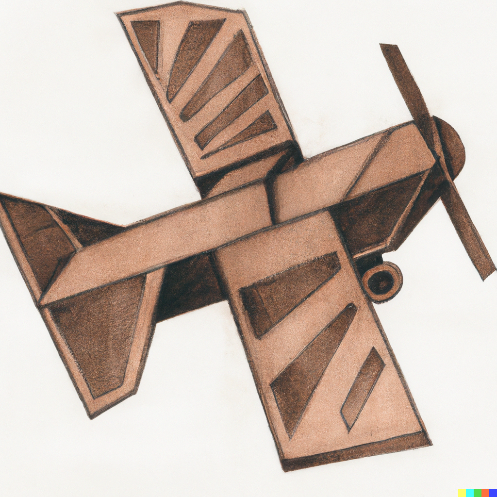
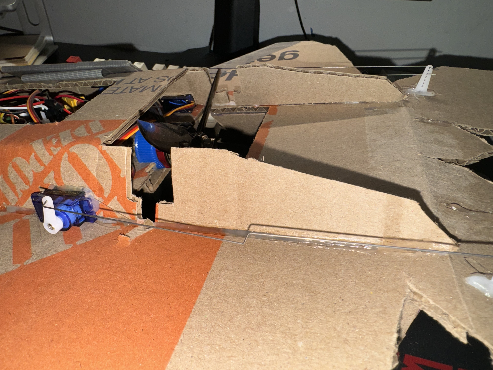

<!-- PROJECT LOGO -->
 

  

<!-- ABOUT THE PROJECT -->
# bluetooth rc
This program allows Bluetooth control of a prototype RC plane with a computer mouse. The mouse movements control the pitch, roll, and yaw motions of the RC plane, which has 2 servos for the brushless motor connected. The RC plane receives data transmitted via Bluetooth on a Raspberry Pi Zero W, which converts the mouse movement to a PWM signal sent to the servos and brushless motor. 
  
The data transmitted amounted to 20 bytes, including 1 four-byte integer representing the mouse scroll for thrust and 2 eight-byte floating-point values representing the x and y coordinates of the mouse movements. The data is encapsulated in a structure before transmission and destroyed after transmission.
  
The send.py includes the program run by the host computer to send the mouse movements to the RC plane. The recv.py is run by the RC plane Raspberry Pi Zero W to receive and convert the values to control the movement of the RC plane.

## Images

  

  

     

  

     
